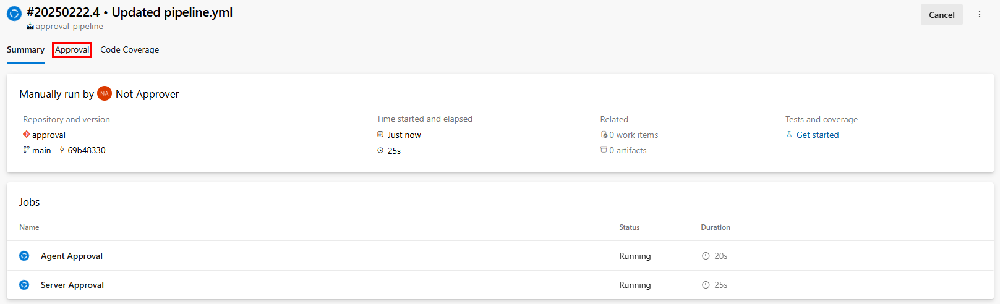
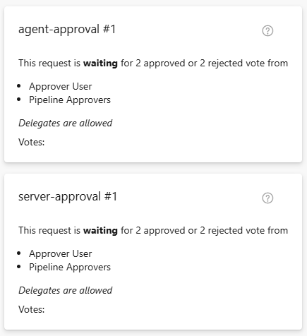
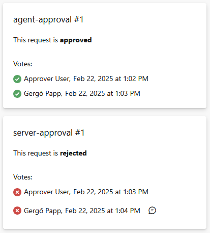
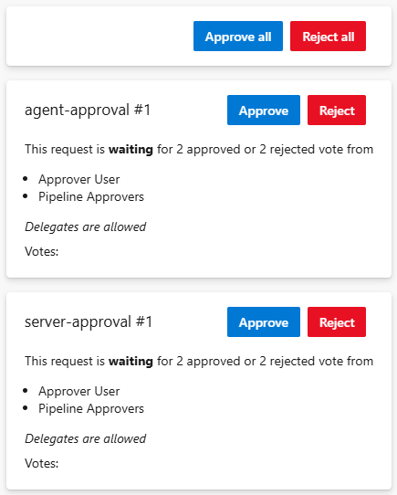
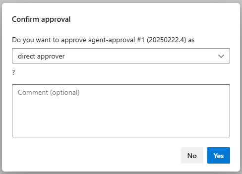

# Approval tab

**In this article**
- [Usage](#usage)
- [Disabling](#disabling)
- [See also](#see-also)

Show the pipeline run's approval requests and allow their approval/rejection. 
 
## Usage

The approval tab is placed in yaml pipeline runs.  

It is visible only any of the extension's tasks is added to the pipeline run. 
When this tab is present, it shows all approval requests referencing the pipeline run, regardless of state.  

If any of the approval requests is waiting for approval, their approvers can cast their votes in the tab as well.

## Disabling

It is possible to disable the approval tab for the whole organization or for individual projects. 
For the details, please see the [Extension features](/flexible-approvals/common/extension-features.md).

## See also

- [Extension features](/flexible-approvals/common/extension-features.md)
- [Glossary](/flexible-approvals/common/glossary.md)